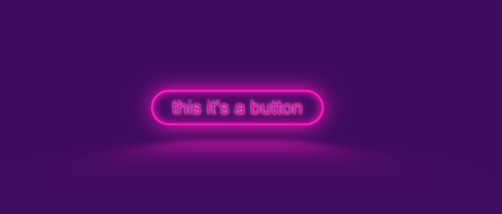

# template pruebanodemachine => **ButtonMachine**
only you need create with mkdir .\botonneon\ and .\botonneon\src\
#### run 
``` 
.\botonneon\
node pruebaNodeMachineButtonNeonLiteMode.js
``` 
#### **buttonNeon1**



#### **buttonNeon2**


#### nodeMachine


```
// ?$$$$$$$$$$$$$$$$$$$$$$$$$$$$$$$$$$$$$$$$$$$$$$$$$$$$$$$$$$$$$$$$$$$$$$$$$$$$$$$$$$$$$$$$$$$$$$$$$$$$$$$$$$$$$$$$$$$$$$$$$$$$$$$$$$$$$$$$$$$$$$$$$$$$$$
// ?$$$$██████╗ ██████╗ ██╗   ██╗███████╗██████╗  █████╗ ███╗   ██╗ ██████╗ ██████╗ ███████╗███╗   ███╗ █████╗  ██████╗██╗  ██╗██╗███╗   ██╗███████╗$$$$$
// ?$$$$██╔══██╗██╔══██╗██║   ██║██╔════╝██╔══██╗██╔══██╗████╗  ██║██╔═══██╗██╔══██╗██╔════╝████╗ ████║██╔══██╗██╔════╝██║  ██║██║████╗  ██║██╔════╝$$$$$
// ?$$$$██████╔╝██████╔╝██║   ██║█████╗  ██████╔╝███████║██╔██╗ ██║██║   ██║██║  ██║█████╗  ██╔████╔██║███████║██║     ███████║██║██╔██╗ ██║█████╗  $$$$$
// ?$$$$██╔═══╝ ██╔══██╗██║   ██║██╔══╝  ██╔══██╗██╔══██║██║╚██╗██║██║   ██║██║  ██║██╔══╝  ██║╚██╔╝██║██╔══██║██║     ██╔══██║██║██║╚██╗██║██╔══╝  $$$$$
// ?$$$$██║     ██║  ██║╚██████╔╝███████╗██████╔╝██║  ██║██║ ╚████║╚██████╔╝██████╔╝███████╗██║ ╚═╝ ██║██║  ██║╚██████╗██║  ██║██║██║ ╚████║███████╗$$$$$
// ?$$$$╚═╝     ╚═╝  ╚═╝ ╚═════╝ ╚══════╝╚═════╝ ╚═╝  ╚═╝╚═╝  ╚═══╝ ╚═════╝ ╚═════╝ ╚══════╝╚═╝     ╚═╝╚═╝  ╚═╝ ╚═════╝╚═╝  ╚═╝╚═╝╚═╝  ╚═══╝╚══════╝$$$$$
// ?$$$$$$$$$$$$$$$$$$$$$$$$$$$$$$$$$$$$$$$$$$$$$$$$$$$$$$$$$$$$$$$$$$$$$$$$$$$$$$$$$$$$$$$$$$$$$$$$$$$$$$$$$$$$$$$$$$$$$$$$$$$$$$$$$$$$$$$$$$$$$$$$$$$$$
// * *██╗███╗   ██╗██████╗ ███████╗██╗  ██╗t  ██████╗  ██████╗ ████████╗ ██████╗ ███╗   ██╗███╗   ██╗███████╗ ██████╗ ███╗   ██╗  
// * *██║████╗  ██║██╔══██╗██╔════╝╚██╗██╔╝i  ██╔══██╗██╔═══██╗╚══██╔══╝██╔═══██╗████╗  ██║████╗  ██║██╔════╝██╔═══██╗████╗  ██║
// * *██║██╔██╗ ██║██║  ██║█████╗   ╚███╔╝ t  ██████╔╝██║   ██║   ██║   ██║   ██║██╔██╗ ██║██╔██╗ ██║█████╗  ██║   ██║██╔██╗ ██║
// * *██║██║╚██╗██║██║  ██║██╔══╝   ██╔██╗ l  ██╔══██╗██║   ██║   ██║   ██║   ██║██║╚██╗██║██║╚██╗██║██╔══╝  ██║   ██║██║╚██╗██║
// * *██║██║ ╚████║██████╔╝███████╗██╔╝ ██╗e  ██████╔╝╚██████╔╝   ██║   ╚██████╔╝██║ ╚████║██║ ╚████║███████╗╚██████╔╝██║ ╚████║
// * *╚═╝╚═╝  ╚═══╝╚═════╝ ╚══════╝╚═╝  ╚═╝  ╚═════╝  ╚═════╝    ╚═╝    ╚═════╝ ╚═╝  ╚═══╝╚═╝  ╚═══╝╚══════╝ ╚═════╝ ╚═╝  ╚═══╝
// /*
const fs = require("fs");
var path = require("path");
const title = "ButtonNeon"; /* NameComponent */  /* $ */
const v = `./botonneon`;
const a_ = `/src/${title}.js`;

const dataAppJs = `import React from "react";\n
import "./${title}.css";\n
export default function ${title} (props) {\n
\t	const onClickButton = (msg) => {\n \t\t
		alert(msg);\n\t
	};\n\t
	return (\n\t\t
		<React.Fragment>\n\t\t\t
			<div className="${title}Div">\n\t\t\t\t
				<header className="Button-header">\n\t\t\t\t\t
					<button\n\t\t\t\t\t\t
						className="${title}"\n\t\t\t\t\t\t
						onClick={() => onClickButton("def")}\n\t\t\t\t\t
					>\n\t\t\t\t\t\t\t
						this it's a button\n\t\t\t\t\t
					</button>\n\t\t\t\t
				</header>\n\t\t\t
			</div>\n\t\t
		</React.Fragment>\n\t
	);\n
}
`
fs.promises
    .mkdir(path.dirname(a_), { recursive: true })
    .then((x) =>
        fs.promises.writeFile(v + a_, dataAppJs));
console.log("[+] Creado:\t" + v + a_, "\t ",title);
// //         console.log("Archivo creado");
// /* $title.js 1.  botonneon/src/$title.js jsx */


// /* $title.css 1.2.Writting a file: src/index.css cssreacts*/
const ac = `/src/${title}.css`;         // todo  $$ $$ $$ $$ $$ $$ $$ $$ $$ 
                                        // todo  ██████╗███████╗███████╗ $$
                                        // todo ██╔════╝██╔════╝██╔════╝ $$
                                        // todo ██║     ███████╗███████╗ $$
                                        // todo ██║     ╚════██║╚════██║ $$
                                        // todo ╚██████╗███████║███████║ $$
                                        // todo  ╚═════╝╚══════╝╚══════╝ $$
const dataAppCss = `:root {\n
	--clr-neon: hsl(317 100% 54%);\n\t
	--clr-bg: hsl(323 21% 16%);\n\t
	--clr-p: #400c60;\n
}\n
*,\n
*::before,\n
*::after {\n\t
	box-sizing: border-box;\n
}\n\t
	/* transform: scale(.6);  */\n\t
.App-logo {\n
	height: 40vmin;\n
	pointer-events: none;\n
}\n
.App-logo:hover {\n
	height: 10vmin;\n
	pointer-events: none;\n
}\n
.Button-header {\n
	background-color: #400c60; /* bg transparent*/\n
	min-height: 100vh;\n
	display: grid;\n
	flex-direction: column;\n
	align-items: center;\n
	justify-content: center;\n
	font-size: calc(10px + 2vmin);\n
}\n
.${title} {\n
	cursor: pointer;\n
	font-size: 4rem;\n
	text-decoration: none;        \n
	display: inline-block;\n
	position: relative;\n
	padding: 0.25em 1em;\n
	box-shadow: 2px 2px 22px #ffff;\n
	border: 0.125em solid var(--clr-neon);\n
	border-radius: 9rem; \n
	text-shadow: 0 0 0.125em hsl(0 0% 100% / 0.9), 0 0 0.45em currentColor;\n
	box-shadow: inset 0 0 2rem 0 var(--clr-neon),0 0 4rem 0 var(--clr-neon);\n
	background-color: transparent;/* color bg */\n
	transition: background-color 100ms linear;\n
	color: var(--clr-neon);\n
}\n
.ButtonNeon::after {\n
	content: "";\n
	position: absolute;\n
	top: 0;\n
	bottom: 0;\n
	left: 0;\n
	right: 0;\n
	box-shadow: 0 0 2em 0.5rem var(--clr-neon);\n
	opacity: 0;\n
	transition: opacity 100ms linear;\n
	border-radius: 9rem;\n
}\n
.ButtonNeon::before {\n
	content: "";\n
	position: absolute;\n
	background: var(--clr-neon);\n
	top: 120%;\n
	right: 0;\n
	bottom: 0;\n
	width: 100%;\n
	height: 100%;\n
	transform: perspective(0.99em) rotateX(40deg) scale(1, 0.35);\n
	filter: blur(1em);\n
	opacity: 0.7;\n
	border-radius: 9rem;\n
}\n
.${title}:hover ,\n
.ButtonNeon:focus {\n
	color: var(--clr-bg);\n
	background: var(--clr-neon);\n
	text-shadow: none;\n
	border-radius: 9rem;\n
}\n
.ButtonNeon:hover::after {\n
	opacity: 1;\n
	border-radius: 9rem;\n
}` 

fs.promises
    .mkdir(path.dirname(ac), { recursive: true })
    .then((x) =>
        fs.promises.writeFile(
            v + ac, dataAppCss));
console.log("[+] Creado:\t" + v + ac, "\t ",title);
// /* $title.css 1.2. I have a file: src/$title.css */

```